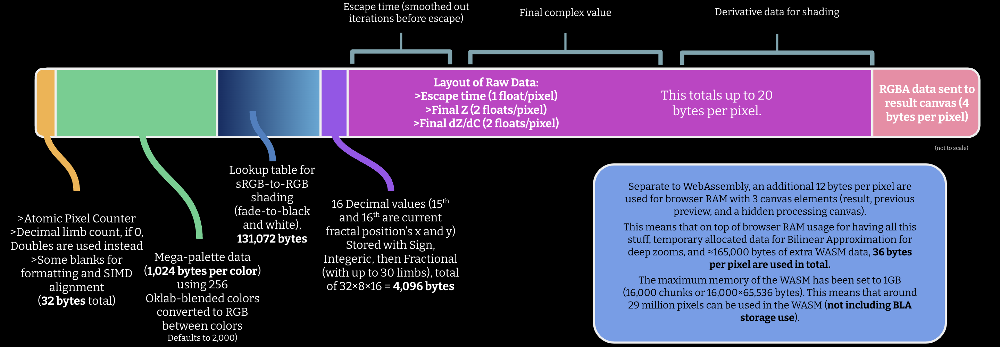

## FractalSky
A fractal viewer optimized for the web. Supports a variety of features, utilizing multicore processing when possible, and functioning. It automatically falls back to a version without `SharedArrayBuffer` and uses `ServiceWorkers` to make it work offline in most HTTPS settings and browsers.
**View online at https://fractalsky.netlify.app/** and take a look at the options with the Info button. When a new version appears you may need to do a force refresh (Ctrl/Cmd+Shift+R).

All code is under AGPL v3. If you're looking for how the C++ WebAssembly works and information on memory regions, check fractal.c (which you should be able to access by replacing this URL's .html with .c); to optimize it uses a lot of hardcoded memory regions. Otherwise, main.js and worker.js are the JS sections.

Customize the number of WebWorkers by adding `?workers=8`, changing the value as needed (ignored when `SharedArrayBuffer` is not supported).

TODO:
- Decimal (fixed-point) algorithms
- Phong shading
- BLA, Pertubation
- Better Welcome and Help UI, explanation
- Memory shifting

KNOWN ISSUES:
- Currently, the progress line lags 1 frame behind without SharedArrayBuffer. This can't be fixed with the current setup unfortunately.

## Memory Documentation
(This memory layout is inaccurate due to not being implemented yet!)

By default, the memory maximum is 16000 pages (or 1,250 MB by default). You can add the `?maxMB=4096` URL parameter if you must use more memory and lower the number as needed.

## How the algorithm works
**(This has not been implemented yet!)**
The algorithm for the fractal program uses pertubation and bilinear approximation when the zoom (in this case, the difference per pixel) is less than 2^-48.

### Local installation instructions
- [Install Emscripten](https://emscripten.org/docs/getting_started/downloads.html) if you don't have it already. Make sure `emcc` and `wasm-opt` work (wasm-opt is from Binaryen).
- Activate emsdk through your terminal every time you set this up (easy to forget)! Depending on your OS this is different. You'll need to do this to set up the PATH variables correctly.
- It is recommended to use the [tasks.json](.vscode/tasks.json) already provided, as this makes the build process easier. You can delete the build tasks that aren't for your OS. Use **Tasks: Run Task** for this case.
- If you are not using VSCode, then compile with `emcc` using the following to get a version that supports shared memory:
<details>
<summary>Click to see compilation instructions (Unix)</summary>
emcc -O3 -ffast-math -s SHARED_MEMORY=1 -s SIDE_MODULE=2 -s NODEJS_CATCH_REJECTION=0 -s WASM_BIGINT=0 -Wl, --no-entry -s ALLOW_MEMORY_GROWTH=1 -s EXPORTED_FUNCTIONS=\"['_run','_render']\" -s ERROR_ON_UNDEFINED_SYMBOLS=0 -s DISABLE_EXCEPTION_CATCHING=1 -o fractal.wasm fractal.cpp && { TEMP_WASM=$(mktemp -t wasm_opt_XXXXXX); wasm-opt fractal.wasm -o \"$TEMP_WASM\" -O4 --strip-debug --strip-dwarf --strip-producers --enable-threads && mv \"$TEMP_WASM\" fractal.wasm; }
</details>
<details>
<summary>Click to see compilation instructions (Windows PowerShell)</summary>
emcc -O3 -ffast-math -s SHARED_MEMORY=1 -s SIDE_MODULE=2 -s NODEJS_CATCH_REJECTION=0 -s WASM_BIGINT=0 -Wl,--no-entry -s ALLOW_MEMORY_GROWTH=1 -s EXPORTED_FUNCTIONS="['_run','_render']" -s ERROR_ON_UNDEFINED_SYMBOLS=0 -s DISABLE_EXCEPTION_CATCHING=1 -o fractal.wasm fractal.cpp; if ($LASTEXITCODE -eq 0) { $TEMP_WASM = [System.IO.Path]::GetTempFileName() + ".wasm"; wasm-opt fractal.wasm -o $TEMP_WASM -O4 --strip-debug --strip-dwarf --strip-producers --enable-threads; if ($LASTEXITCODE -eq 0) { Move-Item -Path $TEMP_WASM -Destination fractal.wasm -Force; } else { Write-Error "wasm-opt failed."; } } else { Write-Error "emcc failed."; }
</details>

(Very importantly, FractalSky uses two WASM files, `fractal.wasm` and an inlined version of `fractalUnshared.wasm`. Compile `fractalUnshared.wasm` by deleting `-s SHARED_MEMORY=1` from the command changing the export file name, then convert it to Base64. It's advised to use `tasks.json` because all the commands are rather complicated!)

(Make sure your .cpp files and workspace are in your current directory when running the commands!)
- Next, set up your local live server. It's easiest to install the Microsoft Live Preview extension from VSCode. If it doesn't work the first time, try to install an older version and maybe update back (this did the trick for me). Be sure to add the following JSON to your VSCode's `settings.json` if you do use it:
```json
    "livePreview.httpHeaders": {
        "Cross-Origin-Embedder-Policy": "require-corp",
        "Cross-Origin-Opener-Policy": "same-origin"
    }
```
Be sure to open up the server in an external browser! FractalSky works best in Firefox, although Chrome also works.

### Poking around
You can import the resulting .wasm into [wasm2wat](https://webassembly.github.io/wabt/demo/wasm2wat/) and modify Emscripten constants (explained below). Then import into [wat2wasm](https://webassembly.github.io/wabt/demo/wat2wasm/) and paste in the .wat text. (Make sure to click **threads** as an enabled feature in wat2wasm, or else it won't compile for both parts of the process.) Keep in mind it is (probably) way easier to poke around in the C++

Minor note, as this chunk of WAT:
```js
  (func $__wasm_call_ctors (export "__wasm_call_ctors") (export "__wasm_apply_data_relocs") (type $t0))
```
gets deleted in the final version for both `fractal.wasm` and `fractalUnshared.wasm` due to being completely useless. (It's an artifact of `emcc` compiling.)


Minor tangent, as you may have seen this line in the WAT result as well:
```js
  (import "env" "memory" (memory $env.memory 0 65536 shared))
```

Don't worry: even if the memory is set to 65536 chunks the JS will still override the module, setting the memory limit to 16000. This is just a minor detail.